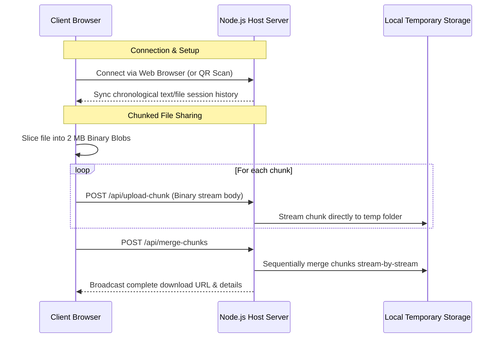

# 💡 LANtern

A lightweight, completely offline web application for real-time text and file sharing over local Wi-Fi networks (LAN or Mobile Hotspots). 

No internet connection is required. One device acts as the host/server, and any connected device on the network can participate instantly via a standard web browser without installing any software or apps.

---

## ✨ Features

- 💬 **Real-Time Text Messaging:** Chat instantly with peers on your Wi-Fi network with persistent bi-directional communication.
- 📁 **High-Performance File Sharing:** Upload and download files of any size (up to 5 GB on PC) using robust, memory-efficient client-side file slicing and server-side binary stream chunk merging.
- 🖼️ **Media Previews:** Inline browser previews for images, video streaming, and audio playback cards.
- ⚡ **Zero-Configuration Access:** Late-joining clients automatically sync full chat history upon connecting.
- 📱 **QR Code Easy-Connect:** The host generates an on-the-fly QR code of the LAN URL, enabling mobile peers to scan and join instantly.
- 🔔 **Synthesized Web Audio Tones:** Real-time incoming messages trigger Web Audio API synthesized notification bells offline, without requiring external MP3 downloads.
- 🔒 **Total Privacy (Ephemeral Storage):** Files and chat histories are 100% volatile and cleared immediately from the host server on startup or restart.
- 🎨 **Glassmorphism UI:** Premium space-themed layout with drifting ambient background orbs, smooth transitions, custom scrollbars, and a horizontally swipeable mobile nav bar.

---

## 📐 Architecture & Flow



---

## 🛠️ Tech Stack

- **Backend:** Node.js (v18+), Express (static files, binary uploads, range headers for media seeking)
- **Protocols:** Socket.io (WebSocket client-server sync)
- **Frontend:** HTML5, Vanilla CSS3 (Custom Glassmorphism theme, CSS perspective), Native JavaScript
- **Dependencies:** `qrcode` (dynamic QR code generation)

---

## ⚡ Quick Start

### 1. Prerequisites
Ensure you have **Node.js** installed on the host machine.

### 2. Install Dependencies
Clone the repository, navigate into the directory, and install the modules:
```bash
npm install
```

### 3. Start the Server
```bash
npm start
```
*For development with auto-reload, run:*
```bash
npm run dev
```

On start, the console will output local URLs that other devices on the same Wi-Fi network can visit to connect:
```text
=================================================
   💡 LANtern - Local Wi-Fi Sharing Server 💡
=================================================
Host localhost: http://localhost:3000
Devices on the same network can connect to:
 👉 http://192.168.1.15:3000/
=================================================
```

---

## ⚙️ Environment Configurations

LANtern automatically adjusts to the system environment to prevent memory buffers from crashing:

| Host Environment | Default Limit | Config Method | Safe Max Limit |
|---|---|---|---|
| **Mobile Phone** (via Termux) | **50 MB** | Automatically applied by default | 100 MB |
| **Computer** (PC / Laptop) | **5 GB** | Configured via Environment Var | 5 GB |

### Customizing limits
Set the `MAX_FILE_SIZE_MB` and `PORT` environment variables to override defaults:
```bash
# Set custom port and 500 MB upload limit on macOS/Linux
PORT=8080 MAX_FILE_SIZE_MB=500 npm start
```

### Port Collision Handling
When starting LANtern, if the target port (default `3000`) is already in use:
1. **By another LANtern instance:** The startup process will notify you of the active instance's URL and prompt you: `Would you still like to proceed to create another instance? (y/N)`. Answering `y` or `Y` will spin up the new instance on the next available port.
2. **By an entirely different process:** LANtern will automatically fall back to the next available port (e.g. `3001`) without prompting.


---

## ♿ Accessibility & Motion
LANtern fully respects users who configure their devices to reduce motion transitions. Under the hood, CSS media queries target the system standard `prefers-reduced-motion: reduce` preference, disabling the 3D rotating background ambient orbs and sliding animation transitions.
